# Node Monitoring with Uptime Kuma and Telegram Notifications

This guide will help you set up Uptime Kuma to monitor the online status of your Lilypad node and check for Proof-of-Work (PoW) signals. You'll also learn how to configure notifications through Telegram to receive alerts in case of any issues. This setup is particularly useful for detecting downtimes in the PoW signal processing of a node.

## Table of Contents
- [Prerequisites](#prerequisites)
- [Install Uptime Kuma](#install-uptime-kuma)
- [Setting Up Telegram Notifications](#setting-up-telegram-notifications)
- [Monitoring Online Status](#monitoring-online-status)
- [Monitoring PoW Signals](#monitoring-pow-signals)
- [Setting up the Status Page](#setting-up-the-status-page)
- [Final Steps](#final-steps)

## Prerequisites
Before you begin, ensure you have the following:
- A server or machine capable of running Docker.
- A Telegram account.
- Basic knowledge of Docker and JSON queries (helpful, but not mandatory).

## Install Uptime Kuma
First, you'll need to install Uptime Kuma using Docker. This will create a containerized environment where Uptime Kuma will run.

1. Open a terminal on your server or local machine.
2. Run the following command to install Uptime Kuma:
    ```bash
    docker run -d --restart=always -p 3001:3001 -v uptime-kuma:/app/data --name uptime-kuma louislam/uptime-kuma:1
    ```
    This command does the following:
    - Runs the Uptime Kuma container in detached mode (`-d`).
    - Sets it to always restart (`--restart=always`).
    - Maps port 3001 on your machine to port 3001 in the container.
    - Creates a persistent volume (`-v uptime-kuma:/app/data`) to store data.

3. Access Uptime Kuma by navigating to `http://localhost:3001` in your web browser.

4. Setup your account by entering your email address and password.

## Setting Up Telegram Notifications
To receive notifications via Telegram, you need to create a Telegram bot and configure it in Uptime Kuma. For this we will be using @BotFather, Telegram’s tool for creating and managing bots.

### Step 1: Creating a new Telegram Bot
Use the `/newbot` command to create a new bot. @BotFather will ask you for a name and username, then generate an authentication token for your new bot.

1. Open Telegram and search for `@BotFather`.
2. Start a chat with `@BotFather` and create a new bot by typing `/newbot`.
3. The **name** of your bot is displayed in contact details and elsewhere.

4. The **username** is a short name, used in search, mentions and t.me links. Usernames are 5-32 characters long and not case sensitive – but may only include Latin characters, numbers, and underscores. Your bot's username must end in 'bot’, like 'tetris_bot' or 'TetrisBot'.

5. The **token** is a string, like `110201543:AAHdqTcvCH1vGWJxfSeofSAs0K5PALDsaw`, which is required to authorize the bot and send requests to the Bot API. Keep your token secure and store it safely, it can be used by anyone to control your bot.


### Step 2: Configure the Bot
Disable the option for others to join the bot:
```plaintext
/setjoingroups
@name_of_bot
Disable
```
Replace `name_of_bot` with the actual name of your bot.

**Example**

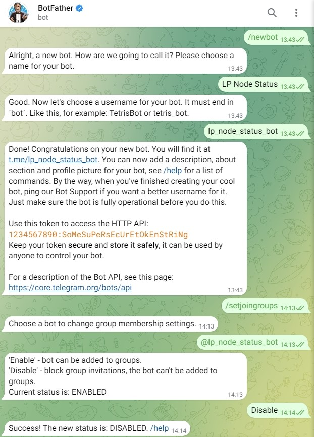

### Step 3: Add Telegram Notifications in Uptime Kuma
1. Log into Uptime Kuma.
2. Navigate to `Settings` -> `Notifications` -> `Setup Notification`
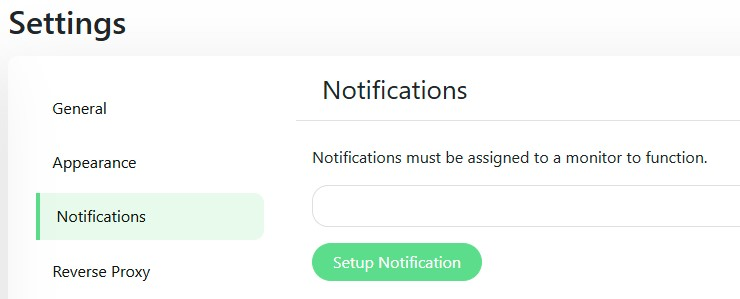
3. Select `Telegram` as the notification type and enter your bot token and chat ID.
`Auto Get` should be able to fetch the chat ID for you.
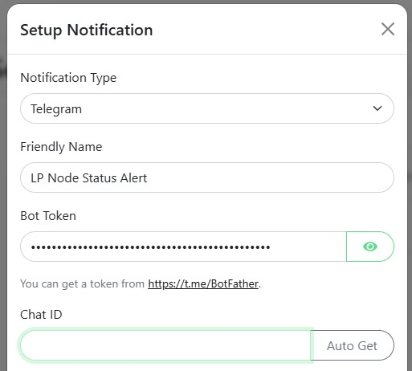
4. Click `Test` to verify that the notification is working. Check your Telegram account for the test notification.

5. Click `Save` to save the notification settings.
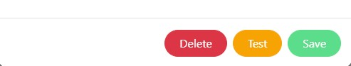

## Monitoring Online Status
1. In Uptime Kuma, go to the `Dashboard` and click `Add New Monitor`.
2. Configure the monitor as follows:
    - **Monitor Type**: HTTP(s) - Json Query
    - **Friendly Name**: e.g., Node Online Status
    - **URL**: `https://api-testnet.lilypad.tech/metrics-dashboard/nodes`
    - **Json Query**: `$[ID="0x123ab...cdefg"].Online`
    - **Expected Value**: `true`
    - **Heartbeat Interval**: `300`
3. Replace `0x123ab...cdefg` in the Json Query with the wallet ID of your node.
4. Enable Notifications.

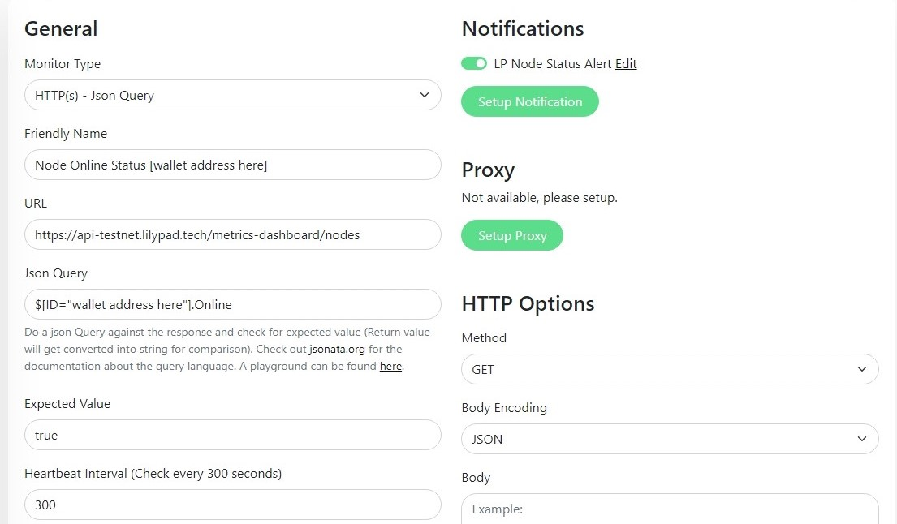

## Monitoring PoW Signals
1. In Uptime Kuma, go to the `Dashboard` and click `Add New Monitor`.
2. Configure the monitor as follows:
    - **Monitor Type**: HTTP(s) - Json Query
    - **Friendly Name**: e.g., Node PoW Signal Checker
    - **URL**: `https://api-sepolia.arbiscan.io/api?module=account&action=txlist&address=0x123ab...cdefg&page=1&offset=1000&sort=desc`
    - **Json Query**:
        ```plaintext
        ($filterTransactions := function($transactions, $methodId, $timeLimit) { 
            $transactions[$.methodId = $methodId and $number($.timeStamp) * 1000 >= $timeLimit] 
        }; 
        $now := $millis(); 
        $oneHourAgo := $now - 3600000; 
        $transactions := result; 
        $filteredResults := $filterTransactions($transactions, "0xda8accf9", $oneHourAgo); 
        $mostRecent := $filteredResults^(>$number(timeStamp))[0]; 
        $expectedValue := "0x8b852ba45293d6dd51b10c57625c6c5f25adfb40"; 
        $mostRecent ? $mostRecent.to = $expectedValue : false)
        ```
    - **Expected Value**: `true`
    - **Heartbeat Interval**: `300`
3. Replace `0x123ab...cdefg` in the URL with the wallet ID of your node. Do not replace the contract ID in the Json Query.
4. Enable Notifications.

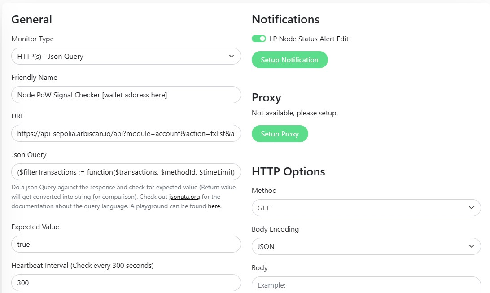

## Setting up the Status Page

1. In Uptime Kuma, go to the `Status Pages` and click `New Status Page`.

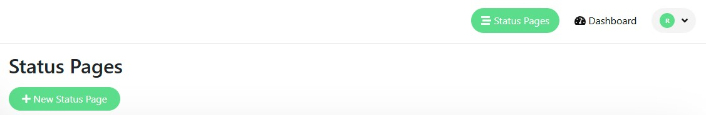

2. Enter a **Name** and a **Slug** for the status page and click `Next` to proceed.
  - **Name**: `Lilypad Node Status`
  - **Slug**: `lilypad-node-status`

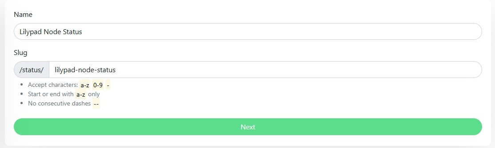

3. Add the monitors you created from the dropdown `Add a monitor:` to the status page and click `Save`.

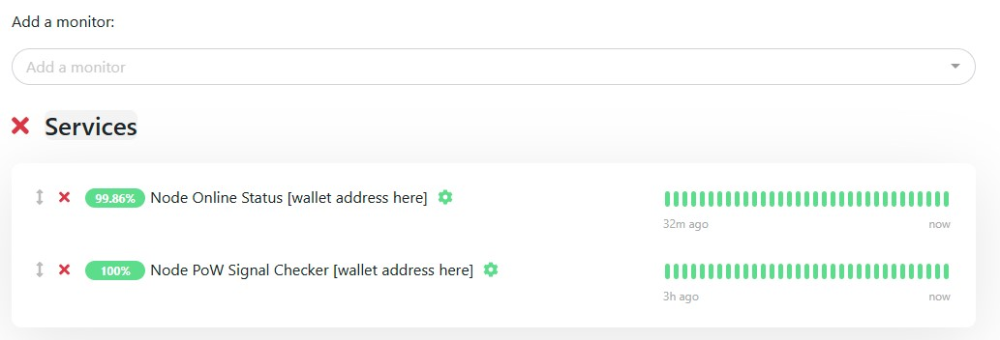

## Final Steps
- Review your monitors and ensure they are correctly configured.
- Test the setup by simulating a node disconnect or PoW signal issue to verify that notifications are received.
- Check out your status page to see the monitoring results.
  eg. `http://localhost:3001/status/lilypad-node-status`

  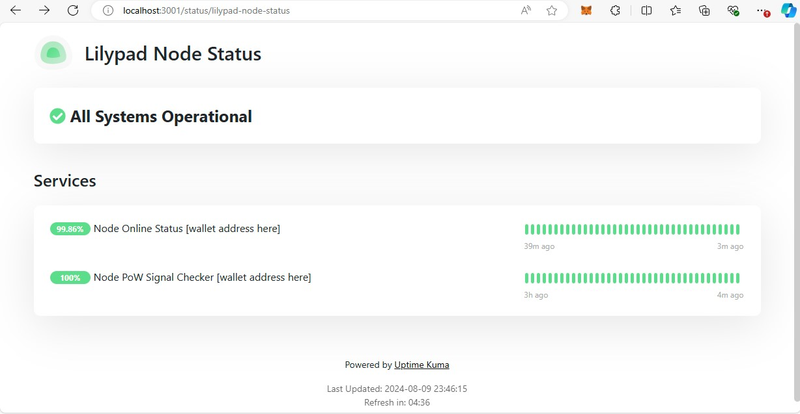

- Be informed in real-time about your node's status and PoW signals through Telegram notifications.

  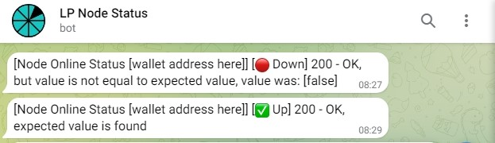

That's it! Your node monitoring setup with Uptime Kuma and Telegram notifications is now complete.