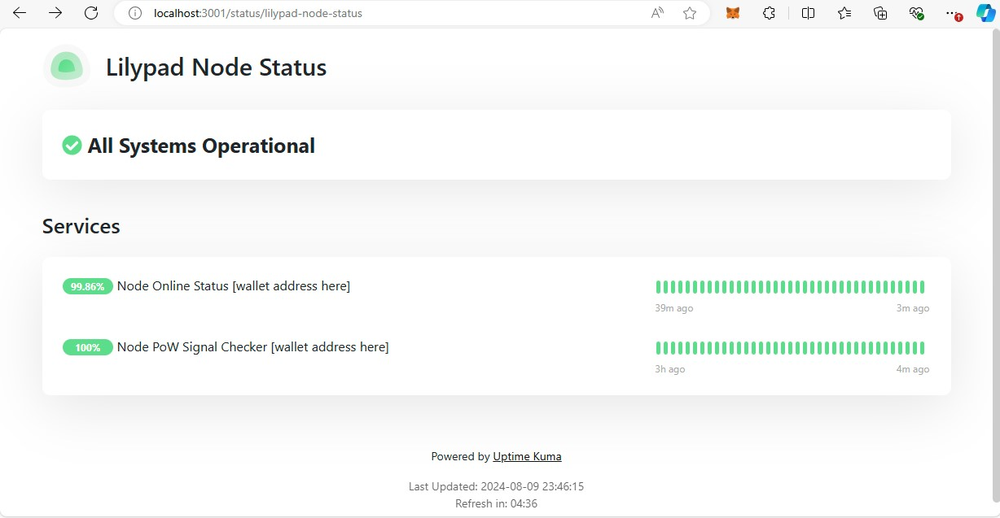
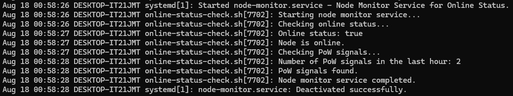

# Node Monitoring and Notification Setup

This repository contains different solutions for monitoring the status of Lilypad Resource Provider (RP) nodes. These can invole monitoring the online status of nodes and sending notifications via Telegram. Or setting up a systemd service to monitor node status at regular intervals and automatically restart the relevant services if the node appears to be offline or no PoW signals have been detected.

> [!NOTE]  
> These solutions are independent of each other and can be used together or separately based on your requirements.

## Table of Contents
- [Uptime Kuma Telegram](#uptime-kuma-telegram)
- [Node Monitor Service](#node-monitor-service)

## Uptime Kuma Telegram

The `kuma-uptime-telegram` directory contains instructions for setting up an Uptime-Kuma Dashboard to monitor the online status and PoW Signals of your nodes and send notifications via Telegram.

For detailed setup instructions, please refer to the [uptime-kuma-telegram README](uptime-kuma-telegram/README.md).

## Node Monitor Service

The `node-monitor-service` directory contains instructions on how to setup a systemd service and timer for monitoring the node status as well as PoW Signals. This setup ensures that your node monitoring service runs at regular intervals and automatically restarts relevant services if an issue is detected.

For detailed setup instructions, please refer to the [node-monitor-service README](node-monitor-service/README.md).
